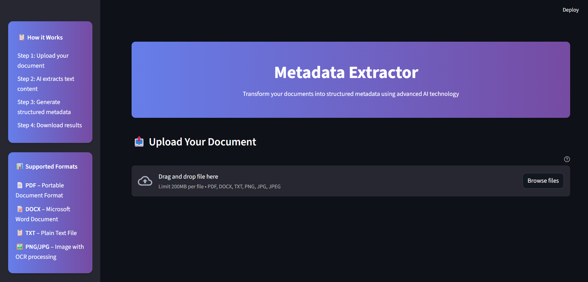
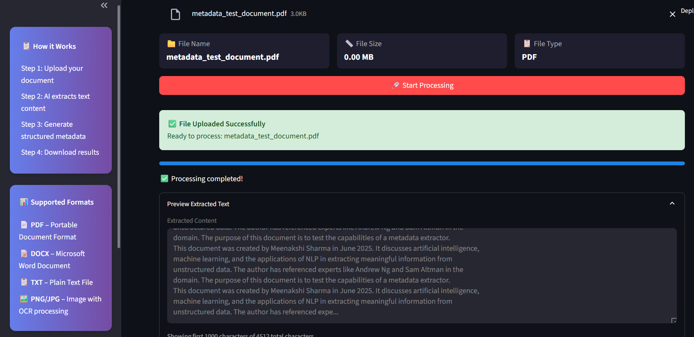
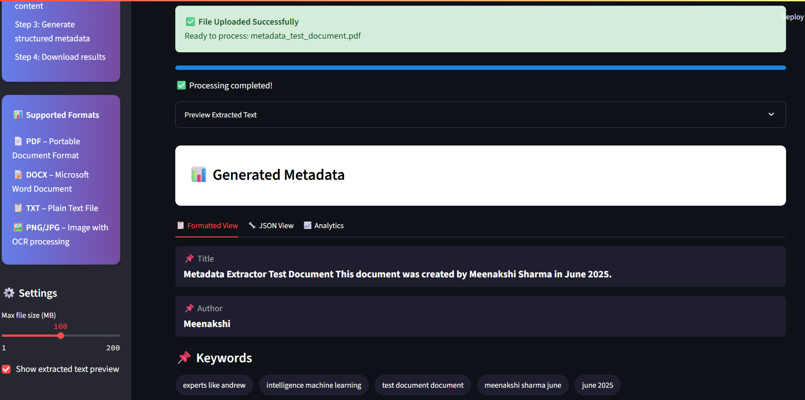
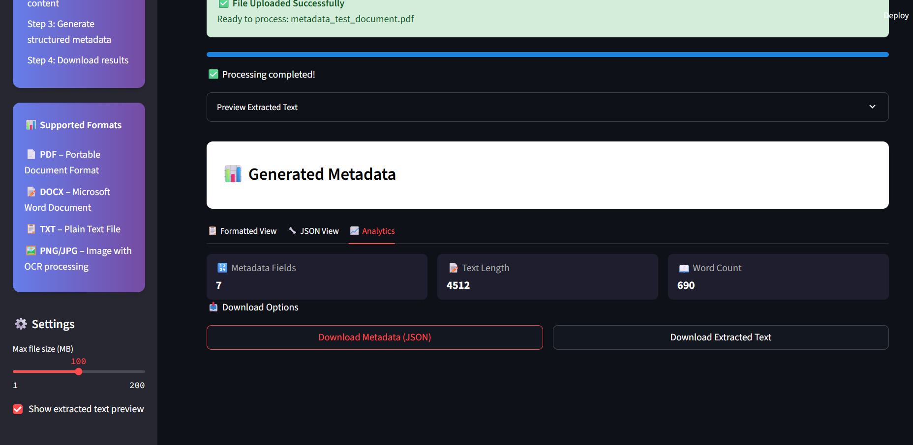
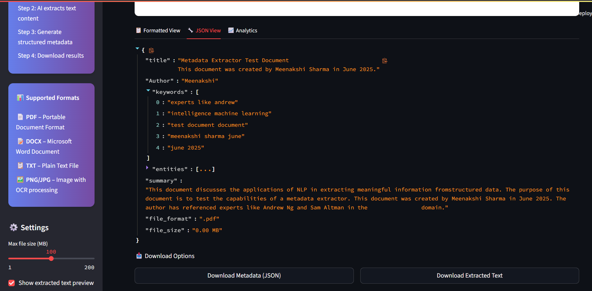

#  Metadata Extractor

**AI-powered document analysis tool**  
Extracts metadata from `.pdf`, `.docx`, `.txt`, and image files using NLP and OCR.

---

## 🚀 Features

- 📝 Extract title, author, keywords, summary, entities
- 📥 Upload: PDF, DOCX, TXT, JPG, PNG
- 🧠 Uses KeyBERT, spaCy, HuggingFace Transformers
- 📷 Cloud OCR support for images (OCR.space)
- 📊 Clean, interactive Streamlit UI
- 📁 Download metadata (JSON) and raw text (TXT)

---

## 🖼️ Screenshots

### 🔹 Home Page


### 🔹 Upload Document & Preview


### 🔹 Extracted Metadata




---

## ⚙️ Setup

### 🔧 Requirements

```bash
pip install -r requirements.txt
You also need to get a free OCR API key from OCR.space.
Update it in file_reader.py like this:
'apikey': 'your_api_key_here'
---
🧪 Run the App
streamlit run app.py
---
🌐 Live Demo
Click here to try it on Streamlit Cloud
---

📁 Folder Structure

.
├── app.py                  # Streamlit interface
├── file_reader.py          # File reading and OCR logic
├── metadata_extractor.py   # Metadata extraction logic
├── requirements.txt
|-- newvid.mp4               #video demonstaration of the app
├── README.md
└── screenshots/   
